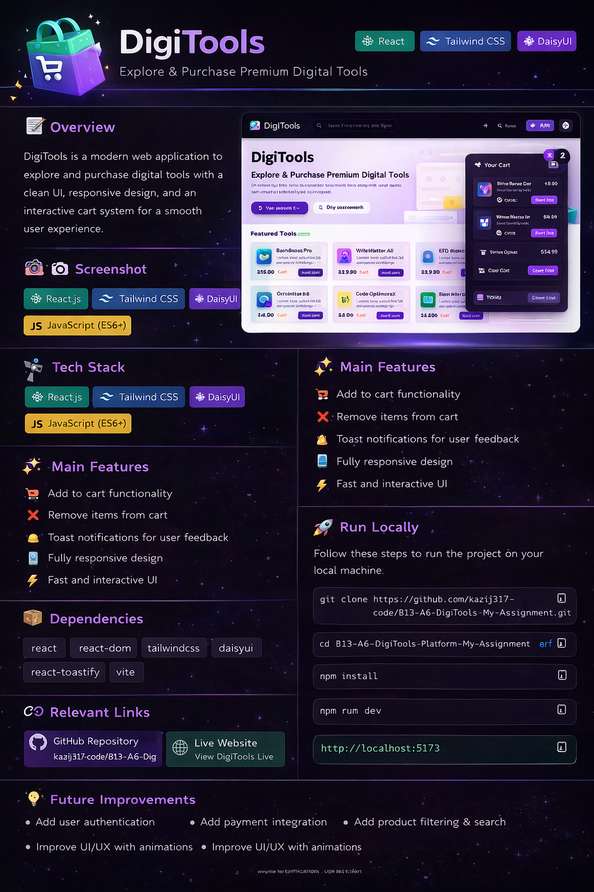

📚 DigiTools:

DigiTools is a modern web application to explore and purchase digital tools with a clean UI, responsive design, and an interactive cart system for a smooth user experience.

📸 Screenshot:

⚙️ Tech Stack:

React.js
Tailwind CSS
DaisyUI
JavaScript (ES6+)

✨ Main Features:

🛒 Add to cart functionality
❌ Remove items from cart
🔔 Toast notifications for user feedback
📱 Fully responsive design
⚡ Fast and interactive UI

📦 Dependencies:

react
react-dom
tailwindcss
daisyui
react-toastify
vite

🚀 Run Locally:

Follow these steps to run the project on your local machine:

1️⃣ Clone the repository:
git clone https://github.com/kazij317-code/B13-A6-DigiTools-Platform-My-Assignment.git

2️⃣ Go to project folder:
cd B13-A6-DigiTools-Platform-My-Assignment

3️⃣ Install dependencies:
npm install

4️⃣ Run the project:
npm run dev

5️⃣ Open in browser:
http://localhost:5173

🔗 Relevant Links:
🌐 Live Site: https://kazij317-code.github.io/B13-A6-DigiTools-Platform-My-Assignment/

💻 GitHub Repo: https://github.com/kazij317-code/B13-A6-DigiTools-Platform-My-Assignment
-----------------------------------------------------------------------------------------------------
# 🚀 DigiTools – Digital Tools Buying Platform

## 📌 Project Name

**DigiTools**

---

## 📝 Description

DigiTools is a modern and user-friendly web application where users can explore and purchase premium digital tools. It provides a smooth shopping experience with a clean UI, responsive design, and interactive cart functionality. Users can easily browse products, add them to the cart, and complete checkout with real-time feedback.

---

## 🛠️ Technologies Used

* React.js
* Tailwind CSS
* DaisyUI
* JavaScript (ES6+)
* React-Toastify (NPM Package)
* JSON (for product data)

React.js, Tailwind CSS, DaisyUI, JavaScript (ES6+), React-Toastify (NPM Package), JSON (for product data)

---

## ✨ Features

1. 🛒 **Smart Cart System** – Add, remove, and checkout products with real-time updates.
2. 🔔 **Interactive Notifications** – Instant feedback using React-Toastify for all actions.
3. 📱 **Responsive UI Design** – Fully responsive layout that works across mobile, tablet, and desktop devices.

---
